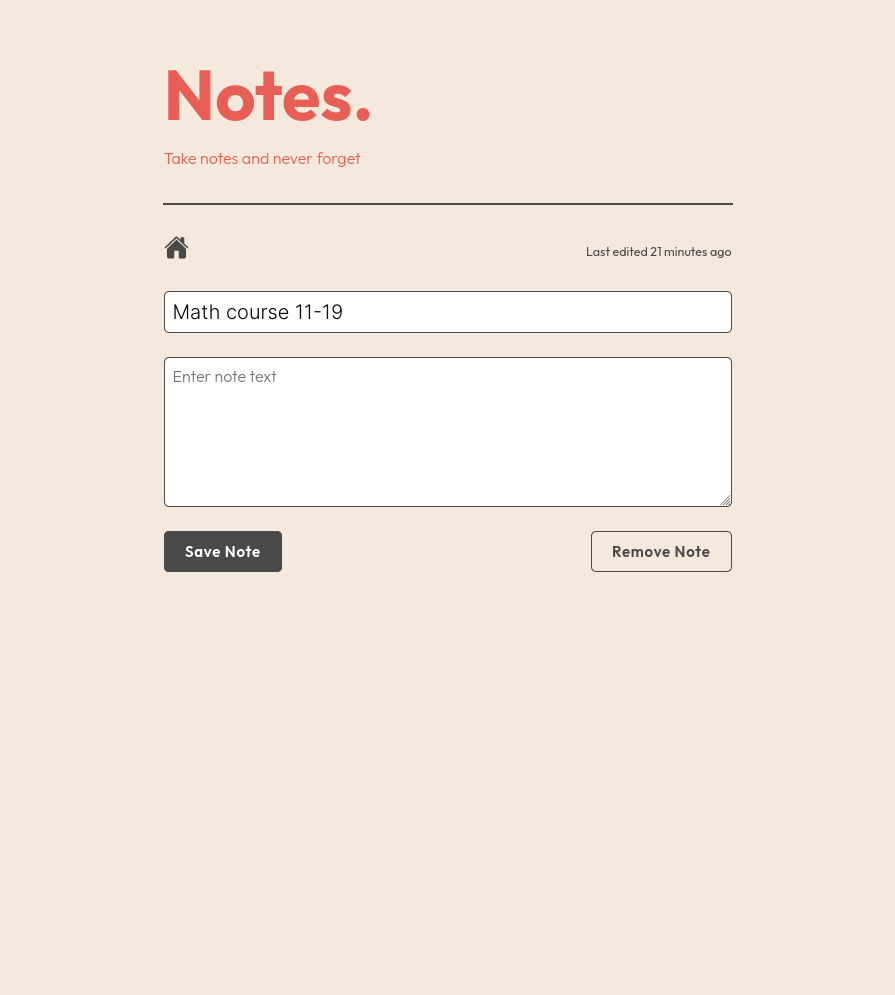

# Notes Applicaton

:------------------------------:|:-------------------------------:
 | 

## Description

- A simple note taking web application.
- You can quickly add, edit or remove notes.
- Dynamically search and order the notes on the main page.
- It uses _uuidv4.js_ and _moment.js._

## Try it out

- [Take a quick look](https://cryptic-deer.github.io/notes-app/index.html)

## Built by using

- Html
- CSS
- JavaScript

## Acknowledgments

- Thanks for [Ionicons](https://ionic.io/ionicons/v4) for the home icon.
